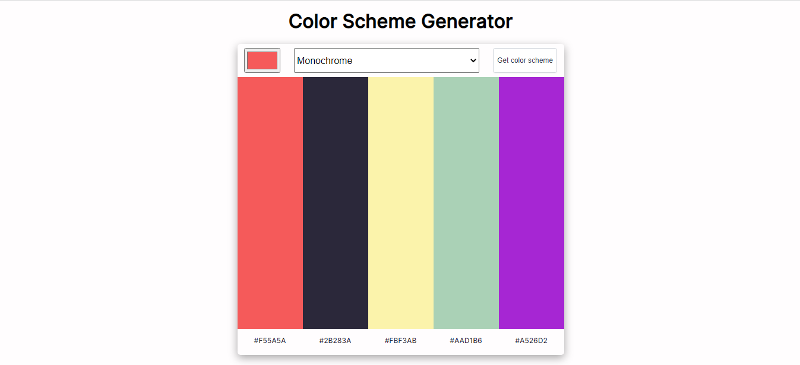

# color-scheme-generator

## Description
Color scheme generator built with Vanilla JavaScript. The user can select base color and scheme type to generate a new color scheme based on the inputs provided. This project is a part of Scrimba front-end developer career path.

## Demo
[Live site URL](https://colorschemegeneratorcsg.netlify.app/)

## Technologies Used

* HTML5
* CSS Flexbox
* Vanilla JavaScript
